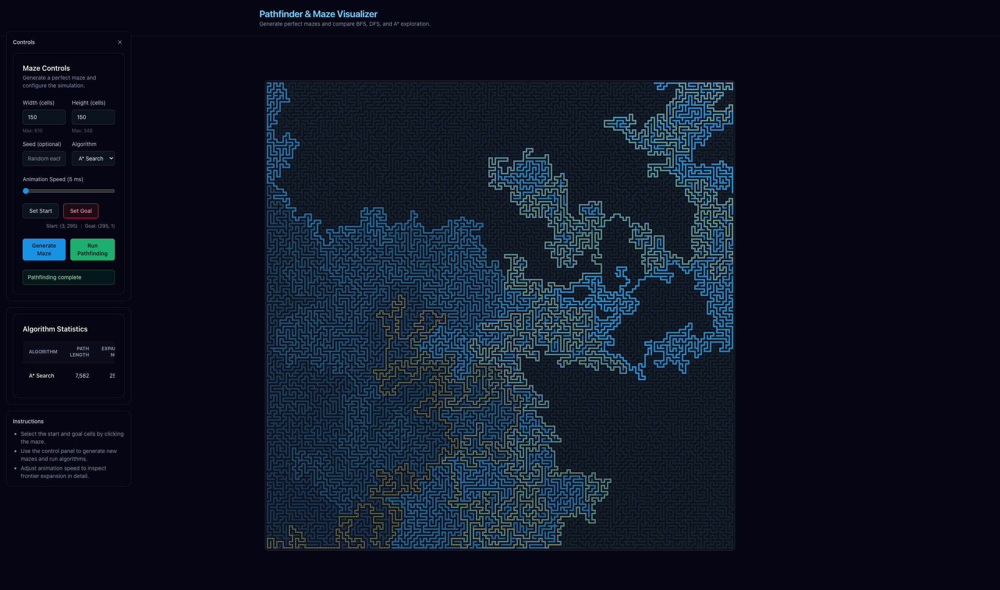

# Pathfinder & Maze Visualizer

[](https://golang.org)
[](https://reactjs.org)
[](https://www.typescriptlang.org)



**Live Demo:** https://pathfinder-simulator.onrender.com/

An interactive playground for generating perfect mazes and visualising classical pathfinding algorithms (BFS, DFS, and A*). The backend is written in Go, the frontend in React + TypeScript with Vite, and production builds bundle the UI directly into the Go binary via `embed`.

## Quick Start

### Prerequisites
- Go 1.22 or newer
- Node.js 20+ and npm 10+

### Get Started in 3 Steps

1. **Clone and setup:**
   ```bash
   git clone <repository-url>
   cd pathfinder
   make setup
   ```

2. **Start development servers:**
   ```bash
   make quick-start
   ```

3. **Open your browser:**
   - Frontend: http://localhost:5173
   - Backend API: http://localhost:8080

That's it! The application will be running with both the frontend and backend servers.

### Alternative Development Workflows

- **Manual setup:** Run `make dev-server` in one terminal and `make dev-web` in another
- **View all options:** Run `make help` or `make dev` for detailed workflow information

## Features

- Perfect maze generation using the recursive backtracker algorithm.
- Interactive canvas for selecting start/goal cells and inspecting visited nodes.
- Pathfinding simulations for BFS, DFS, and A* with node order visualisation.
- Performance statistics (path length, expanded nodes, elapsed time) tracked per algorithm run.
- Animation controls including adjustable delay and a skip button.

## Tech Stack

- **Backend:** Go 1.22+, Gin HTTP router
- **Frontend:** React 19, TypeScript, Vite, Tailwind CSS
- **State Management:** Zustand
- **Build:** Embedded frontend assets in Go binary for single-binary deployment

## Project Structure

```
cmd/server/                # Go entrypoint and static file serving
internal/maze/             # Maze generation logic
internal/algorithm/        # BFS, DFS, and A* implementations
internal/simulation/       # Algorithm orchestration and timing
internal/transport/http/   # HTTP handlers and routing
web/                       # Frontend source (React + Vite)
  ├── src/
  │   ├── api/            # API client and request functions
  │   ├── components/      # React UI components
  │   ├── hooks/           # Custom React hooks for services and animation
  │   ├── store/           # Zustand state management
  │   └── types/           # TypeScript type definitions
  └── README.md            # Detailed frontend documentation
```

📖 **Frontend Documentation:** See [`web/README.md`](web/README.md) for detailed information about the frontend architecture, component structure, data flow, and development workflow.

## Prerequisites

- Go 1.22 or newer
- Node.js 20+ and npm 10+

## Makefile Commands

This project uses a comprehensive Makefile for all development tasks. Here are the most useful commands:

### Development
- `make setup` - Install all dependencies (Go + Node.js)
- `make quick-start` - Setup and start both dev servers automatically
- `make dev-server` - Start Go API server only
- `make dev-web` - Start Vite dev server only
- `make dev` - Show detailed development workflow options

### Building & Running
- `make build` - Build production version (frontend + backend)
- `make run` - Run production binary
- `make run-dev` - Run Go server in development mode

### Utilities
- `make test` - Run all tests
- `make lint` - Run linters
- `make fmt` - Format code
- `make clean` - Clean build artifacts
- `make kill-dev` - Stop all development servers
- `make help` - Show all available commands

## Development Details

The development setup runs two separate servers:
- **Go API Server** (port 8080) - Handles maze generation and pathfinding algorithms
- **Vite Dev Server** (port 5173) - Serves the React frontend with hot reloading

The Vite dev server proxies API requests to the Go server, enabling CORS and providing a seamless development experience.

## Production Build

Build and run the production version with a single binary:

```bash
# Build both frontend and backend
make build

# Run the production binary
make run
```

The production build embeds the compiled frontend assets directly into the Go binary, creating a single deployable executable that serves both the API and UI from the same port.

For manual production builds:
1. `make build-web` - Build frontend assets to `web/dist/`
2. `make build-server` - Compile Go binary with embedded assets
3. `make run` - Start the production server

## Deployment

### Render.com Deployment (Recommended)

Deploy to Render.com for free hosting with automatic SSL and custom domains:

1. **Quick Deploy:**
   - Connect your GitHub repository to [render.com](https://render.com)
   - Render will automatically detect the `render.yaml` configuration
   - Your app will be live in minutes at `https://your-app.onrender.com`

2. **Manual Configuration:**
   - Service Type: Web Service
   - Environment: Go
   - Build Command: `make build`
   - Start Command: `./bin/pathfinder -addr :$PORT`
   - Environment Variables: `GIN_MODE=release`

3. **Custom Domain:**
   - Add your domain in Render dashboard
   - Update DNS records as instructed
   - SSL certificate automatically provisioned

📖 **Quick deployment:** Connect your GitHub repo to Render.com and deploy in minutes!

### Docker Deployment

Build and run with Docker:

```bash
# Build Docker image
make docker-build

# Run container
make docker-run
```

Or use the provided Dockerfile for any container platform.

## API Overview

- `POST /maze/generate` – Generate a perfect maze.
- `POST /simulate` – Run a pathfinding algorithm on a maze grid.
- `GET /healthz` – Simple health check.

Request/response schemas are mirrored on the frontend in `web/src/types` for type safety.

For detailed frontend architecture and implementation details, see [`web/README.md`](web/README.md).

## Troubleshooting

### Common Issues

**"pattern dist/*: no matching files found" error:**
- Run `make build-web` first to build the frontend assets before starting the dev server
- Or use `make quick-start` which handles this automatically

**Port already in use:**
- Kill existing processes: `make kill-dev`
- Or specify different ports: `make dev-server` with custom `-addr` flag

**Frontend not loading:**
- Ensure both servers are running (API on 8080, frontend on 5173)
- Check browser console for CORS or network errors

**Build failures:**
- Run `make clean` to clean artifacts and try again
- Ensure all dependencies are installed with `make setup`

### Getting Help

- Run `make help` to see all available commands
- Check the development workflow with `make dev`

## Notes

- The animation system streams precomputed visited nodes from the backend and replays them client-side for smooth visualisation.
- `Skip Animation` becomes available while a run is in progress.
- Maze start and goal selections are constrained to walkable cells (value `0` in the grid).


